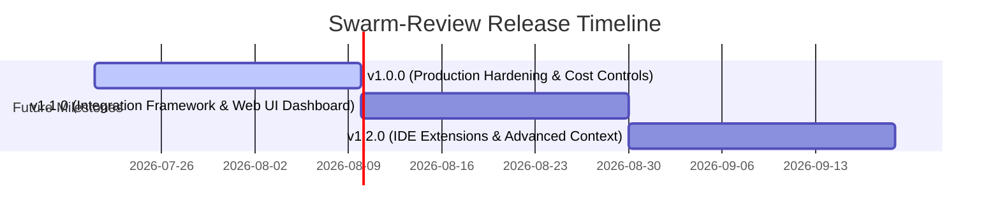

# Swarm-Review Roadmap

Welcome to the future of **swarm-review**! This roadmap outlines our upcoming development milestones, technical design goals, and feature releases as we progress toward a robust, enterprise-grade `v1.0.0` release.



---

## 🗺️ Vision & North Star
Our goal is to make **swarm-review** the premier open-source multi-agent PR review tool. It should:
1. **Be Zero-Config by Default**: Work out-of-the-box with a sensible default agent roster.
2. **Read Like a Live Review Session**: Replicate the collaborative nature of human PR reviews.
3. **Be Cost-Conscious**: Support budgeting, caching, and token usage optimization to run cheaply at scale.

---

## 🚀 Milestones

---

### 📍 Phase 4: Production Hardening, Cost Controls, & Caching (v1.0.0)
*Preparing swarm-review for enterprise adoption, high-volume repositories, and strict security requirements.*

#### Proposed Features
- **Self-Correction & Schema Retry**:
  - If a model's output fails Zod validation, supply the schema error back to the model for a single-pass repair/retry.
- **Token Budgeting & Auto-Fallback**:
  - Define a strict monetary budget per PR or run.
  - If the budget is close to exhaustion, automatically switch agents to cheaper models (e.g., `gpt-4o-mini`, `gemini-2.0-flash`) or skip the debate rounds.
- **Caching Mechanism**:
  - Store previous reviews of files/commits in GitHub Actions Cache.
  - Skip review/debate cycles for files that have not changed relative to a cached commit.
- **OpenTelemetry & LangSmith Integrations**:
  - Support export of tracing data to help developers debug prompt latency, agent reasoning, and token usage metrics.

---

## 🛠️ Configuration Changes (Proposed Schema)
```yaml
# Additions to .swarm.yml in v1.0.0
budget:
  max_cost_usd: 1.50
  fallback_model: gpt-4o-mini
  
cache:
  enabled: true
  key: swarm-review-${{ github.sha }}

static_analysis:
  enabled: true
  commands:
    - run: npm run lint
```

### 📍 Phase 5: Integration Framework & Web UI Dashboard (v1.1.0)
*Expanding beyond GitHub Actions to support local development environments, pre-commit hooks, and a visual dashboard for review reports.*

#### Proposed Features
- **Local CLI Review**:
  - Run the swarm locally on unstaged changes or git branches, producing markdown or HTML reports.
- **Web UI Dashboard**:
  - A lightweight local web app to view complex debates interactively, trace decision paths, and inspect code signatures side-by-side.
- **Pluggable Agent Packages**:
  - Support importing third-party agent rosters and custom prompts from npm packages or external URLs.

---

### 📍 Phase 6: IDE Extensions & Advanced Context (v1.2.0)
*Integrating review cycles directly into developers' inner-loop development workspaces.*

#### Proposed Features
- **VS Code & Cursor Extensions**:
  - Run the review swarm locally on modified files directly inside the editor before committing/pushing.
- **Language Server (LSP) Code Graph Context**:
  - Parse deep dependency relationships across the entire codebase to understand the impact of PR changes globally.
- **Branch-Specific Policy Rules**:
  - Define customized rules and agent assignments depending on the target branch (e.g., stricter security checks on `release` or `main`).

---

> [!IMPORTANT]
> This roadmap is a living document. We welcome community input and feature requests. Please raise issues on GitHub to discuss changes or suggest improvements to the proposed phases!
