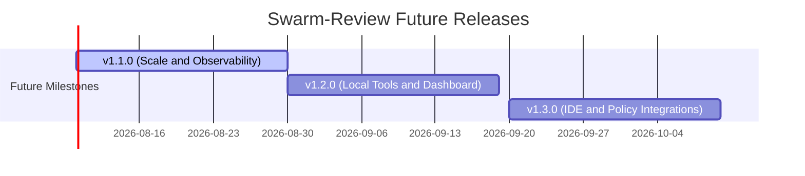

# Swarm-Review Roadmap

This roadmap contains only work planned after the v1.0.0 production release.

## v1.1 requirement-aware review

Integrate the checked-in SpecBridge contract path, validated coverage artifact, and SARIF output while deferring future requirement sources and SpecBench ingestion.

## Vision

Swarm-review should remain zero-hosting by default, read like a real engineering review, and make model cost and behavior observable and controllable.

## v1.1.0: Scale and Observability

- Cache review inputs and results for unchanged files without weakening commit-specific correctness.
- Export optional OpenTelemetry traces for provider latency, retries, token usage, and debate stages.
- Add model pricing configuration so private and newly released models can participate in strict budgets.
- Expand integration coverage for large diffs, provider gateways, and rate-limit behavior.

## v1.2.0: Local Tools and Dashboard

- Add a local CLI for reviewing working-tree changes and branch diffs.
- Provide an optional dashboard for exploring findings, rebuttals, and principal decisions.
- Support reusable, versioned agent-roster packages.

## v1.3.0: IDE and Policy Integrations

- Add editor integrations for pre-push review loops.
- Integrate language-server and code-graph context providers.
- Support branch-specific policy rules and agent assignments.

This roadmap is a living document. Please use GitHub issues to propose or discuss future milestones.
