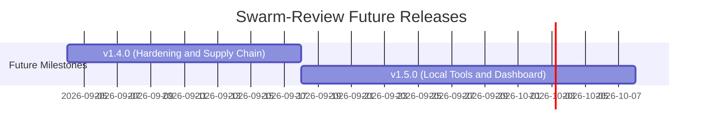

# Swarm-Review Roadmap

This roadmap contains only upcoming, non-completed milestones.

```mermaid
gantt
    title Swarm-Review Future Releases
    dateFormat YYYY-MM-DD
    section Future Milestones
    v1.4.0 (Hardening and Supply Chain) : 2026-09-04, 14d
    v1.5.0 (Local Tools and Dashboard) : 2026-09-18, 20d
```

## Vision

Swarm-review should remain zero-hosting by default, read like a real engineering review, and make model cost and behavior observable and controllable.

## v1.4.0: Hardening and Supply Chain

- Land the trust-boundary work: fork-gated static analysis, secret redaction on all posted output, contained report files.
- Finish the dependency modernization (zod v4, js-yaml v5, octokit 22) and clear the code-scanning backlog.
- Publish npm-hosted SpecBridge packages to replace release-tarball dependencies.

## v1.5.0: Local Tools and Dashboard

- Add a local CLI for reviewing working-tree changes and branch diffs.
- Provide an optional dashboard for exploring findings, rebuttals, and principal decisions.
- Support reusable, versioned agent-roster packages.

This roadmap is a living document. Please use GitHub issues to propose or discuss future milestones.
